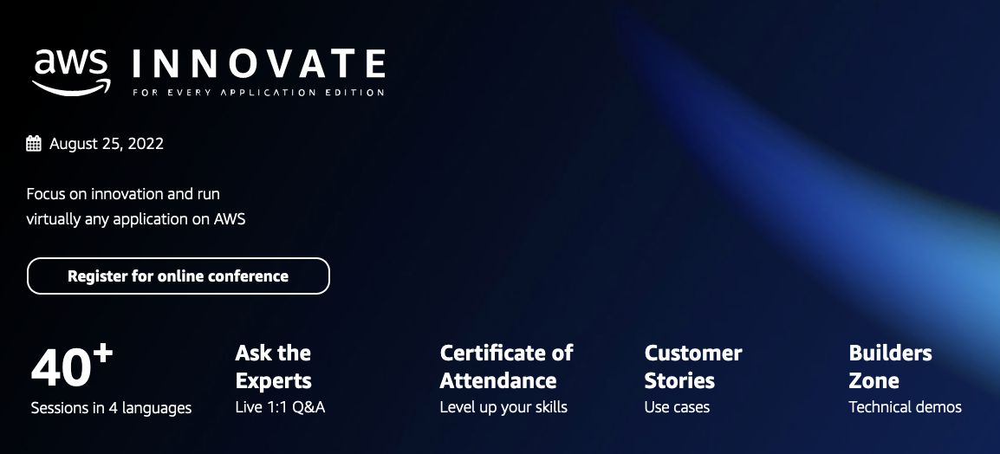

  

The following labs will give you hands-on experience with a number of the topics discussed during the AWS Innovate For Every Application Edition.

ℹ️ **You will run these lab in your own AWS account. Please follow directions at the end of the labs to remove resources to minimize costs.**

These labs will remain available after AWS Innovate For Every Application Edition **You can do them at any time**

# [Achieving Operational Excellence using automated playbook and runbook](https://github.com/aws-samples/build-and-operate-a-secure-and-successful-cloud-operations-model)

Having playbooks and runbooks are one of the fundamental components to ensure your workload is operationally ready for you to achieve Operational Excellence. In this lab, we guide you through the steps to automate your operational activities using runbooks and playbooks built with AWS tools as one of successful cloud operations model.

Duration: Approximately 45 minutes

[View lab instructions](https://github.com/aws-samples/build-and-operate-a-secure-and-successful-cloud-operations-model)

# [Cost and Usage Governance](https://github.com/phonghuule/Cost-And-Usage-Governance)

In this lab, we guide you through the steps to implement cost and usage governance. Learn how to control your cost and usage in alignment with your business requirements.

Duration: Approximately 30 minutes

[View lab instructions](https://github.com/phonghuule/Cost-And-Usage-Governance)

# [Measure Application Resiliency](https://github.com/phonghuule/Measure-Application-Resiliency)

The purpose of this lab is to teach you the fundamentals of using tests to ensure your implementation is resilient to failure by injecting failure modes into your application. 

Duration: Approximately 60 minutes

[View lab instructions](https://github.com/phonghuule/Measure-Application-Resiliency)

# [Deploy Containerized Application To AWS App Runner](https://github.com/phonghuule/aws-app-runner)

In this lab, we build a container image which we push to Amazon Elastic Container Registry (ECR), a fully managed container registry. The container image we have built will then be deployed to AWS App Runner.

Duration: Approximately 45 minutes

[View lab instructions](https://github.com/phonghuule/aws-app-runner)
